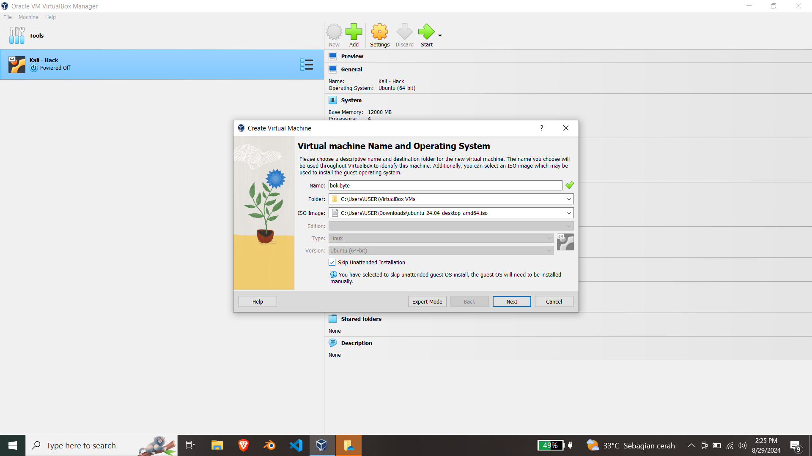
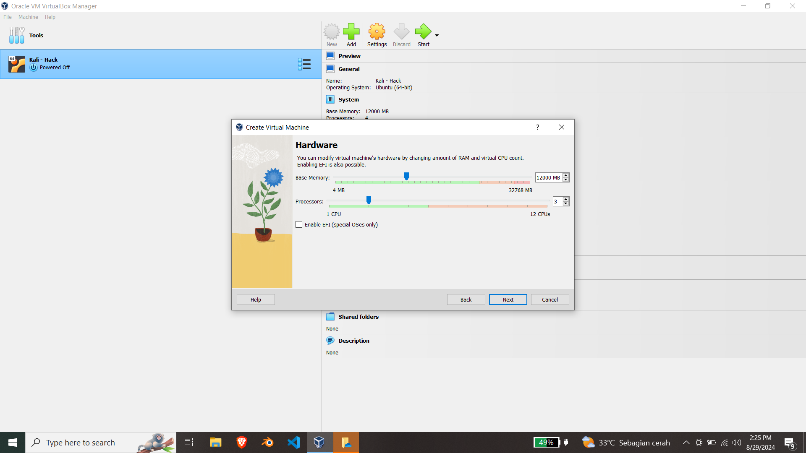
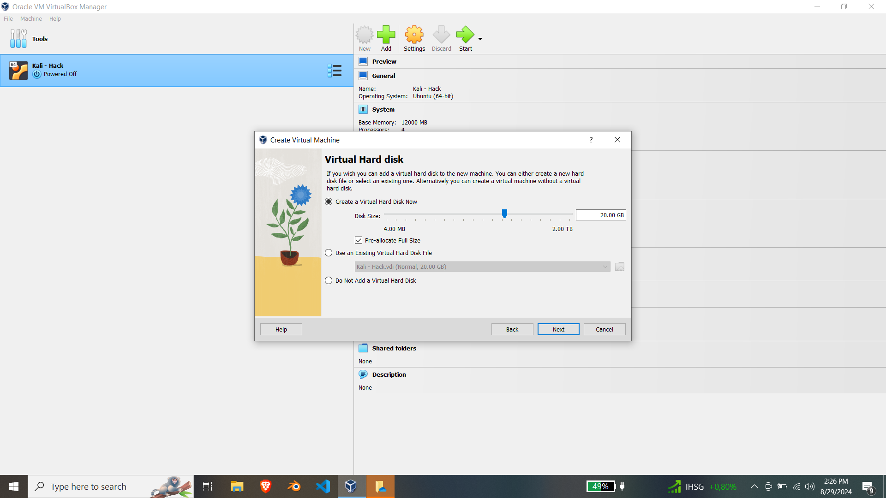
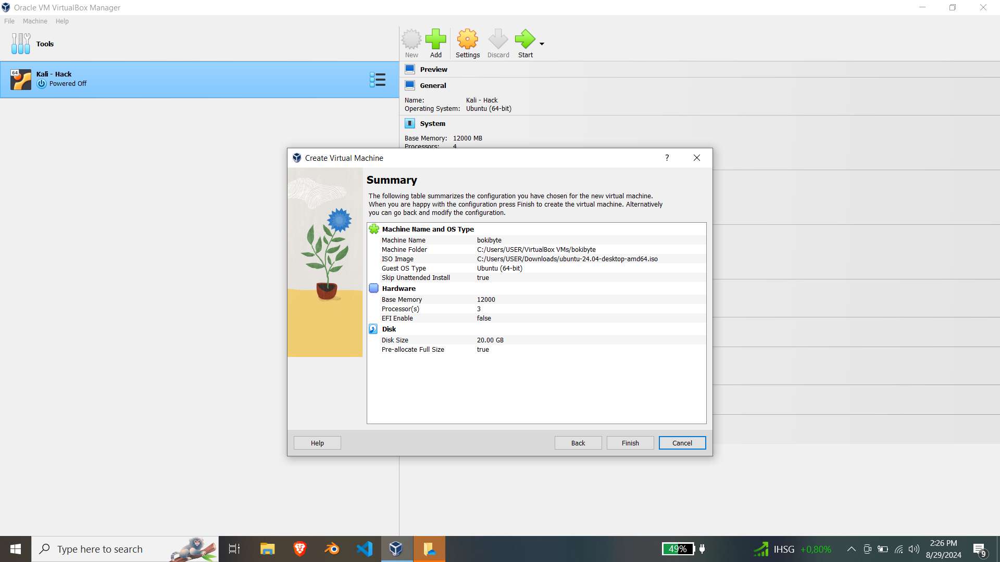
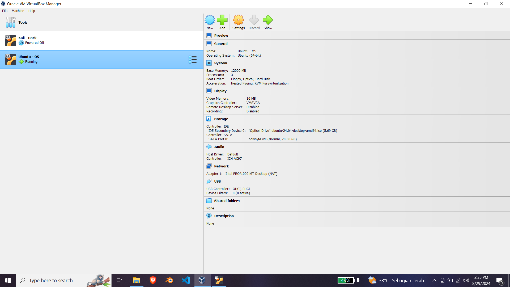

# Instalasi OS - Linux 💻

Halo, Saya akan membagikan cara instalasi Linux dengan list distro yang saya sediakan. disini juga ada tutorialnya. ini dibuat sebagai tugas dan juga untuk mempercantik github supaya tampak hijau wkwk.  

---

# Step Menginstall Linux

- [Instalasi OS - Linux 💻](#instalasi-os---linux-)
- [Step Menginstall Linux](#step-menginstall-linux)
- [Software untuk Virtual Machine](#software-untuk-virtual-machine)
    - [Perbandingan VMware dan VirtualBox](#perbandingan-vmware-dan-virtualbox)
- [Pemilihan Distro](#pemilihan-distro)
    - [Ubuntu](#ubuntu)
    - [Kali](#kali)
    - [Arch](#arch)
    - [Debian](#debian)
    - [Rocky](#rocky)
    - [Mint](#mint)
    - [Tails](#tails)
    - [Fedora](#fedora)
- [Membuat VM](#membuat-vm)
    - [Installasi Ubuntu](#installasi-ubuntu)

---

# Software untuk Virtual Machine

Kebanyakan orang memilih antara menggunakan vm atau dualboot. tetapi, lebih praktis dengan vm. Berikut rekomendasi software vm:

- [Virtual Box](https://www.virtualbox.org/)
- [VMware Workstation](https://blogs.vmware.com/workstation/2024/05/vmware-workstation-pro-now-available-free-for-personal-use.html)

> [!WARNING]
> Pastikan device anda memiliki spesifikasi cukup kuat dan CPU harus mendukung teknologi virtualisasi seperti Intel VT-x atau AMD-V. Untuk user celeron, i know how its pain.

### Perbandingan VMware dan VirtualBox

| Aspek                  | VMware                                | VirtualBox (VBox)                     |
|------------------------|---------------------------------------|---------------------------------------|
| **Performa**           | Umumnya lebih baik dalam hal kinerja, terutama dalam aplikasi berat atau server. | Baik untuk penggunaan umum, tapi performa bisa lebih rendah dibanding VMware pada beban berat. |
| **Kompatibilitas**     | Mendukung berbagai sistem operasi tamu, termasuk integrasi yang baik dengan Windows dan Linux. | Juga mendukung banyak OS tamu, tapi terkadang ada masalah kompatibilitas pada OS tertentu. |
| **User Interface**     | Antarmuka pengguna yang lebih polished dan profesional, terutama pada versi berbayar (Workstation Pro). | Antarmuka sederhana dan fungsional, cukup mudah digunakan untuk pengguna umum. |
| **Fitur**              | Fitur canggih seperti snapshot, cloning, dan integrasi dengan perangkat keras lebih baik pada versi berbayar. | Menyediakan banyak fitur dasar dan beberapa fitur canggih, tetapi dengan kemampuan yang lebih terbatas. |
| **Lisensi**            | VMware Workstation Player tersedia gratis untuk penggunaan pribadi; Workstation Pro berbayar. | Gratis dan open-source, mendukung pengguna pribadi dan komersial tanpa biaya tambahan. |
| **Virtualization**     | Mendukung virtualisasi hardware langsung (VT-x/AMD-V), dengan optimasi yang baik di versi berbayar. | Juga mendukung VT-x/AMD-V, tetapi optimasi bisa kurang efisien dibanding VMware. |
| **Dukungan Komunitas** | Komunitas besar, terutama untuk produk berbayar, dengan banyak dokumentasi dan dukungan resmi. | Komunitas yang sangat besar dan aktif, banyak forum dan dokumentasi tersedia. |
| **Pembaruan**          | Pembaruan reguler, terutama untuk versi berbayar dengan peningkatan performa dan fitur. | Pembaruan reguler, tetapi tidak secepat atau seintensif VMware. |
| **Integrasi Host**     | Integrasi yang baik dengan host OS, terutama pada versi Workstation Pro. | Integrasi yang baik dengan host, tetapi tidak sehalus VMware dalam beberapa kasus. |
| **Biaya**              | Versi berbayar memiliki biaya lisensi yang cukup tinggi, meskipun ada versi gratis dengan fitur terbatas. | Gratis, tanpa biaya lisensi, bahkan untuk penggunaan komersial. |

Selanjutnya, kita akan menggunakan VirtualBox sebagai vm.

# Pemilihan Distro

Distro[^1] linux ada banyak, bisa dipilih sesuai kebutuhan. berikut beberapa listnya:

### [Ubuntu](https://ubuntu.com/download/desktop)

- **Bagusnya**: Ramah pengguna, stabil, dukungan komunitas besar, banyak digunakan oleh pemula dan profesional. Cocok untuk penggunaan sehari-hari, pengembangan perangkat lunak, dan server.
- **Untuk**: Desktop, Server, Cloud.

### [Kali](https://www.kali.org/get-kali/)

- **Bagusnya**: Dirancang khusus untuk keamanan siber dan pengujian penetrasi (pentest). Dilengkapi dengan berbagai alat pentest yang sudah terinstall.
- **Untuk**: Pentesting, Forensik digital, Keamanan siber.

### [Arch](https://archlinux.org/download/)

- **Bagusnya**: Sangat ringan dan cepat, memberikan pengguna kontrol penuh untuk mengatur sistem sesuai kebutuhan. Sangat dihargai oleh pengguna tingkat lanjut karena kesederhanaannya.
- **Untuk**: Pengguna tingkat lanjut, pengguna yang ingin kustomisasi penuh.

### [Debian](https://www.debian.org/distrib/)

- **Bagusnya**:  Stabilitas tinggi, banyak digunakan di server karena kestabilannya. Basis dari banyak distro lain, termasuk Ubuntu.
- **Untuk**: Server, Desktop, Penggunaan umum.

### [Rocky](https://rockylinux.org/download)

>[!CAUTION]
>Ini tidak dibuat oleh Rocky Gerung!

- **Bagusnya**: Stabil dan reliabel, banyak digunakan di lingkungan server enterprise karena berbasis pada Red Hat Enterprise Linux (RHEL).
- **Untuk**: Server, Enterprise.

### [Mint](https://www.linuxmint.com/download.php)

- **Bagusnya**: Antarmuka pengguna yang familiar bagi pengguna Windows, stabil, ramah pengguna, dan ringan. Cocok untuk mereka yang beralih dari Windows.
- **Untuk**: Pengguna desktop umum, Pemula.

### [Tails](https://tails.net/install/download/index.en.html?ref=decredmagazine.com)

- **Bagusnya**: Didesain untuk keamanan dan privasi, dapat dijalankan dari USB tanpa meninggalkan jejak di komputer host.
- **Untuk**: Keamanan, Privasi, Aktivitas sensitif.

### [Fedora](https://fedoraproject.org/id/)

- **Bagusnya**:  Distro cutting-edge yang sering menjadi ujung tombak teknologi baru di dunia Linux. Mendapatkan pembaruan yang sangat cepat.
- **Untuk**:  Developer, pengujian fitur terbaru.

---

# Membuat VM 

Kita akan memakai VirtualBox sebagai vm dan ubuntu sebagai distro. berikut step-by-stepnya:

1. Pertama kita set nama dan lain lain untuk memberi identitas pada vm yang akan kita buat serta memilih disc OS yang akan diinstal.

    

> [!NOTE]
> - Pilih skip unattended installation untukmeminimalkan birokrasi yng ribet!

2. Lalu kita sesuaikan dengan hardware yang kita miliki. semakin besar semakin baik, tetapi semua kembali ke hardware yang dimiliki dan tujuan dari vm yang dibuat.
   
   
   
3. Alokasikan disk untuk digunakan sebagai virtual harddisk.   
   
     

> [!CAUTION]
> Menyetel terlalu rendah dapat membuat vm bermasalahbahkan stuck! gunakan hanya dengan batas minimum 20GB.  

> [!NOTE]
> - centang Pre-allocated untuk membuat disk kosongterlebih dahulu sebagai alokasi ruang atau istilahnya"memesan ruang"
> - jika sudah ada virtual disk pilih use an exiting.

4. Rincian akir jika sudah selesai tekan finish. jika belum bisa kembali atau diatur disetting.

   

5. Setelah selesai jangan lupa di start!

    

### Installasi Ubuntu

1. Pilih keyboard layout sesuai yang dimiliki. (umumnya querty, yaitu english).
2. Hubungkan ke internet (disarankan).
3. Pilih install Ubuntu
4. Pilih interactive install. atau jika sudah memiliki autoinstall bisa pilih automated.
5. piih sesuai kebutuhan.

> [!NOTE]
> - Default hanya utilitas dan basic ubuntu.
> - Extended bagi yang ingin utilitas lebih atau yang ingin menjadikan ubuntu sebagai main OS.

6. Pilih sesuai kebutuhan.
7. Pilih manual (disarankan).
8. buat partisi untuk sistem dengan mount point `/` lalu partisi lagi dengan mount point bebas. setelah itu next.

> [!NOTE]
> - Kalo di windows, ini seperti `C:\` dan `D:\`
> - Jika ruang kosong banyak, bisa dibuat partisi lain juga dengan mount point berbeda.

9. Buat akun untuk OS Ubuntu.

> [!CAUTION]
> - JANGAN LUPA YA WKWKWK

10. ini tampilan dari pilihan penginstallan sebelumnya. jika dirasa ada yang kurang bisa kembali.
11. Kesabaran diuji. silakan tinggal dan bermain game atau aktivitas lainnya.

[^1]:Distro Linux adalah istilah yang merujuk pada distribusi sistem operasi berbasis Linux. Setiap distro terdiri dari kernel Linux yang merupakan inti dari sistem operasi, ditambah dengan koleksi perangkat lunak, manajer paket, antarmuka pengguna, dan utilitas lain yang dirancang untuk memenuhi kebutuhan tertentu atau audiens tertentu.